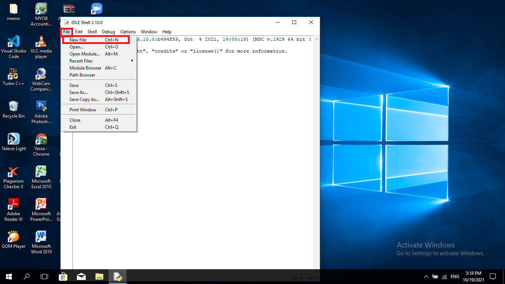

# python
## Input Biodata Pribadi

*Pertama buka idle python

*Klik File-New File (CTRL+N)

*Lalu save file baru tadi dengan cara klik file-save (CTRL+S)

*Lalu simpan file tersebut di tempat yang sudah di siapkan (MENGGUNAKAN FORMAT .py)

*Koding sesuai tugas kalian

*Kemudian pilih run-run modul(f5) untuk menjalankan program

*HASILNYA

